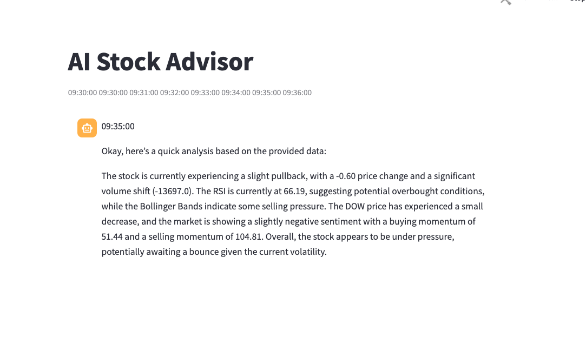

### AI Stock Advisor
**Real-Time Technical Analysis Meets Local LLM Intelligence**
**AI Stock Advisor** is a high-frequency market monitoring tool that bridges the gap between raw financial data and actionable intelligence. It tracks major tech stocks (Apple, Google, Microsoft) and the Dow Jones Index in real-time, calculates complex technical indicators, and leverages a local gemma3:1b model via Ollama to provide professional-grade trading insights every 5 minutes.


-------------------------------------------------------------------------------------------------------------------------------------

### 3. Technology Stack
**- Languages:** Python 3.9+

**- Web Framework:** [Streamlit](https://streamlit.io/)(Real-time UI)

**- Data Source:** [yfinance](https://pypi.org/project/yfinance/)(Yahoo Finance API)

**- Data Analysis:** Pandas & Numpy

**- AI Engine:** [Ollama](https://ollama.com/) (Running gemma3:1b)

**- Scheduling:** [Schedule](https://pypi.org/project/schedule/)

-------------------------------------------------------------------------------------------------------------------------------------

### 4. Prerequisites and Installation 
**Prerequisites**

**1. Install Ollama & gemini3:1b+** 

This Project requires a local instance of Ollama to handle the AI analysis

1. Download and install Ollama from [ollama.com](https://ollama.com/)

2. Open your terminal and pull the model

```bash
Ollama run gemma3:1b

```


**2. Clone and Install Dependencies:** 

**Installation Steps**

**1. Clone the repository**
```bash
git clone git@github.com:carlos-marin1742/AI-Advisor-with-OLLAMA.git
```

**2. Install Dependencies:**
```bash
pip install -r requirements.txt
```


**4. Run the Server:**
To  launch the advisor, you must use Streamlit CLI. Running the script via standard python will not utilize the UI correctly
```bash
streamlit run stock-trader.py
```
-------------------------------------------------------------------------------------------------------------------------------------

### 5. What happens next
**1. Markey Sync:** The app fetches the latest 1-minute interval data for APPL, GOOG, MSFT, and ^DJI

**2. Live Updates:** Every 10 seconds, the "rolling window" updates with new simulated data points.

**3. Technical Crunching:** The system calculates **RSI, Bollinger Bands**, and **EMA** on the fly.

**4. AI Broker Insight** Every 5 minutes the, AI generates a concise sentiment report based on the calculated momentum and volatility.

**Sample App image**

**Running AI Stock Advisor Screen**



### 6. Contact and Support 
**- Developer:** Carlos Marin

**- Project Link:** [Github Link](https://github.com/carlos-marin1742/AI-Advisor-with-OLLAMA)